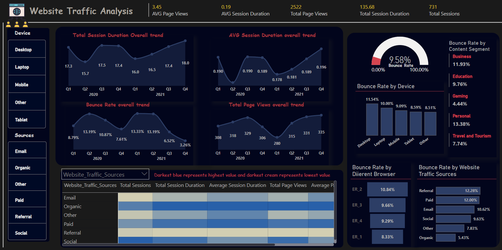
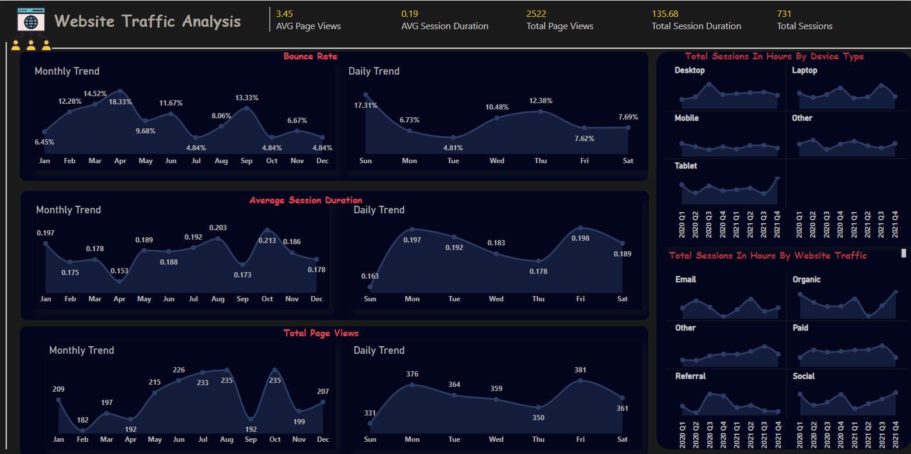
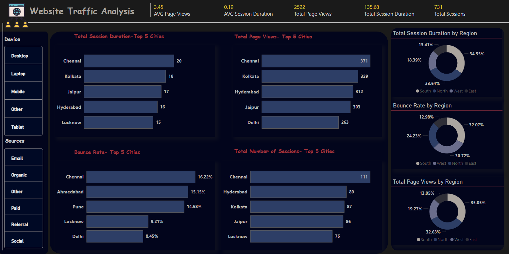

# 🌐 Website Traffic Analysis Dashboard

## 📌 Project Overview

The Website Traffic Analysis Dashboard is a Business Intelligence project developed using **Power BI** and **SQL** to analyze website performance, visitor behavior, traffic acquisition channels, and user engagement metrics.

This dashboard transforms raw website traffic data into actionable insights that help businesses improve digital marketing strategies, optimize user experience, and make data-driven decisions.

---

## 🎯 Business Objective

Modern businesses rely heavily on website traffic to generate leads, sales, and customer engagement. Understanding visitor behavior is critical for improving website performance.

This project aims to:

* Monitor website traffic trends.
* Analyze visitor engagement metrics.
* Evaluate traffic acquisition channels.
* Measure website performance across devices and browsers.
* Identify high-performing regions and cities.
* Support data-driven marketing decisions.

---

## 🛠️ Tools & Technologies

| Category              | Technology              |
| --------------------- | ----------------------- |
| Business Intelligence | Power BI                |
| Database Querying     | SQL                     |
| Data Processing       | Power Query             |
| Data Source           | Website Traffic Dataset |
| Data Visualization    | Power BI Desktop        |

---

## 📊 Key Performance Indicators (KPIs)

### Session Duration

* Total Session Duration
* Average Session Duration
* Monthly Session Trends
* Quarterly Session Trends

### Bounce Rate

* Overall Bounce Rate
* Device-Specific Bounce Rate
* Content Category Bounce Rate

### Page Views

* Total Website Page Views
* Page Views by Device Type
* Page Views by Traffic Source

### Traffic Sources

* Organic Search
* Referral Traffic
* Social Media
* Email Campaigns
* Paid Advertisements

### Geographic Insights

* Region-Wise Performance
* City-Wise Traffic Analysis
* User Engagement by Location

---

## 📈 Dashboard Features

### 1️⃣ Session Duration Analysis

* Track overall session duration trends.
* Compare user engagement across devices.
* Analyze session duration by region and city.
* Identify high-engagement visitor segments.

### 2️⃣ Bounce Rate Monitoring

* Measure user retention performance.
* Analyze bounce rate trends over time.
* Compare bounce rates across devices and content categories.
* Identify areas requiring optimization.

### 3️⃣ Page View Analysis

* Monitor total page views.
* Compare page views generated by different traffic sources.
* Evaluate page view contribution by device type.

### 4️⃣ Traffic Source Performance

Analyze performance of:

* Organic Search
* Email Marketing
* Social Media Campaigns
* Referral Sources
* Paid Advertising

Key metrics include:

* Total Sessions
* Session Duration
* Bounce Rate
* Page Views

### 5️⃣ Geographic Analysis

* Region-Wise Traffic Analysis
* City-Wise User Engagement
* Performance Comparison Across Regions
* Identification of Growth Opportunities

### 6️⃣ Device & Browser Analytics

* Desktop vs Mobile vs Tablet Performance
* Browser-Specific Engagement Metrics
* Platform Optimization Insights

---

## 📊 Business Insights

The dashboard helps stakeholders:

✅ Identify top-performing traffic sources

✅ Improve digital marketing effectiveness

✅ Reduce bounce rates

✅ Increase user engagement

✅ Optimize website performance

✅ Understand visitor behavior patterns

✅ Support strategic decision-making

---

## 📂 Project Structure

```text
website-traffic-analysis/
│
├── website-traffic-analysis-main/
│   ├── report1.png
│   ├── report2.png
│   ├── report3.png
│   ├── Website Traffic Analysis.pbix
│   ├── SQL Queries.sql
│   └── Dataset.csv
│
├── README.md
└── .gitignore
```

---

# 📸 Dashboard Screenshots

## Dashboard Overview



---

## Website Performance Analysis



---

## Geographic & Regional Analysis



---

## 🚀 How to Use

### Requirements

* Power BI Desktop
* Website Traffic Dataset
* SQL Database (Optional)

### Steps

1. Clone the repository.

```bash
git clone https://github.com/Ananthsairam/website-traffic-analysis.git
```

2. Open the Power BI Dashboard file.

3. Refresh the data source if required.

4. Explore interactive filters and visualizations.

---

## 📚 Skills Demonstrated

* SQL Querying
* Data Analytics
* Business Intelligence
* Power BI Dashboard Development
* Data Visualization
* KPI Design
* Data Modeling
* Power Query
* Website Performance Analysis

---

## 💼 Business Value

This solution enables organizations to:

* Monitor website traffic efficiently.
* Improve digital marketing performance.
* Optimize customer engagement.
* Increase conversion opportunities.
* Support strategic growth initiatives.

---

## 🔮 Future Enhancements

* Real-Time Traffic Monitoring
* Predictive Traffic Forecasting
* Customer Journey Analysis
* Conversion Funnel Analytics
* Automated KPI Reporting

---

## 👨‍💻 Author

### Ananthsairam Goud

Aspiring Data Analyst | Business Intelligence Enthusiast

### Technical Skills

* SQL
* Power BI
* Python
* Excel
* Machine Learning
* Data Analytics

GitHub: https://github.com/Ananthsairam

LinkedIn: Add your LinkedIn profile link here

---

## ⭐ Project Status

✅ Completed

This project is part of my Data Analytics Portfolio showcasing SQL, Power BI, Data Visualization, and Business Intelligence skills.
